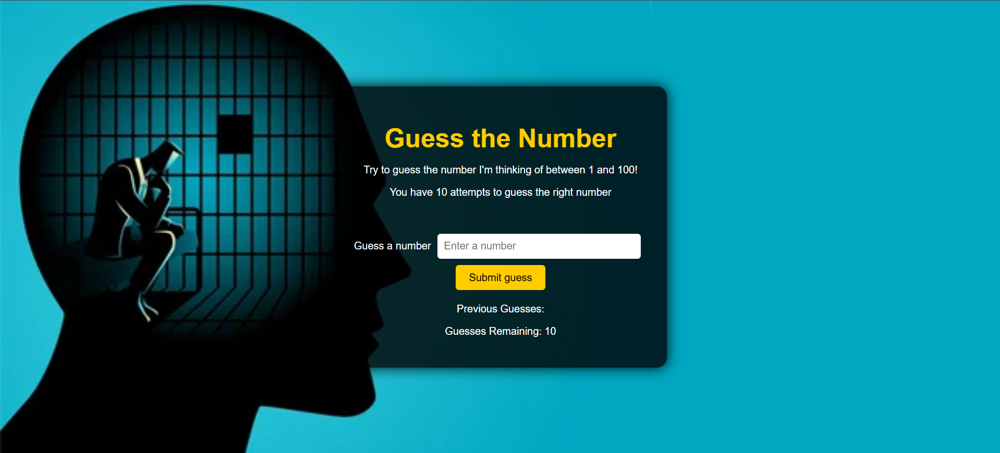
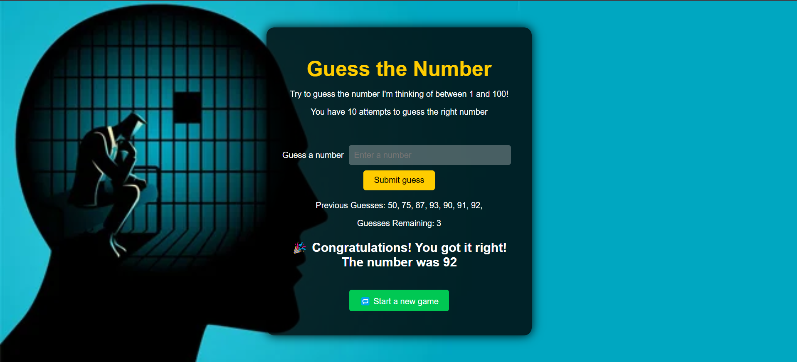
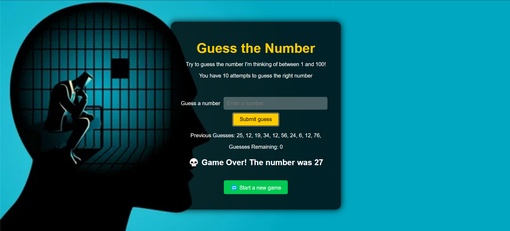

# 🎯 Guess the Number Game

Welcome to the **"Guess the Number"** game! This is a fun, interactive number-guessing game built using **HTML**, **CSS**, and **JavaScript**. You get 10 chances to guess a secret number between **1 and 1000**. Can you guess it before the chances run out?


## 🧠 How to Play

1. The computer secretly picks a number between **1 and 1000**.
2. You have **10 attempts** to guess the correct number.
3. After each guess, you’ll get a hint:
   - 📉 "Too low!"
   - 📈 "Too high!"
4. If you guess the number correctly, you win! 🎉
5. If not, the game reveals the correct number and lets you **start a new game**.

---

## 🔧 Tech Stack

| Tech        | Usage                     |
|-------------|----------------------------|
| HTML5       | Structure & layout         |
| CSS3        | Styling and UI             |
| JavaScript  | Game logic & interaction   |


---

## 💡 Features

- Responsive layout and beautiful UI
- Live feedback with intuitive hints (📈/📉)
- Remaining attempts tracker
- Option to start a new game after winning or losing
- Background image and dark theme for immersive feel

---

## 🚀 Demo




### 🖥️ Run Locally
1. Clone the repository:

```bash
git clone https://github.com/yourusername/guess-the-number.git
```
2.Navigate into the project folder:
```bash
cd guess-the-number
```
3.Open index.html in your favorite browser.
